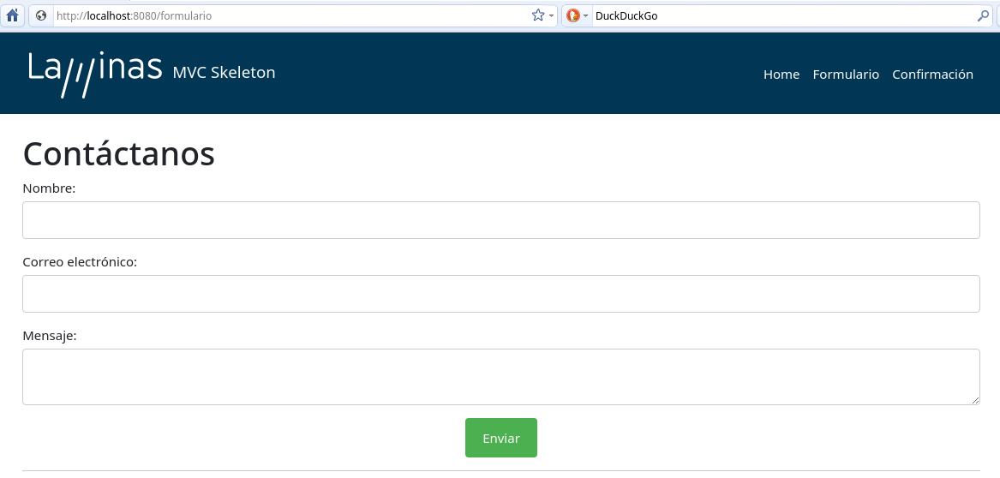
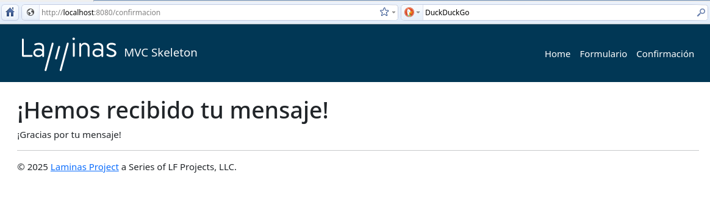

# Laminas Formulario

Este proyecto es un formulario desarrollado con el framework Laminas. Permite la confirmación de recepción de la información enviada a través del formulario.

## Instalación

Para instalar el proyecto, sigue estos pasos:

1. Clona el repositorio:
    ```bash
    git clone <URL_DEL_REPOSITORIO>
    ```
2. Navega al directorio del proyecto:
    ```bash
    cd laminas-formulario
    ```
3. Instala las dependencias utilizando Composer:
    ```bash
    composer install
    ```

## Configuración

Configura el proyecto según tus necesidades. Asegúrate de tener configurado el entorno de desarrollo adecuado.

## Uso

Para usar el formulario, sigue estos pasos:

1. Inicia el servidor de desarrollo:
    ```bash
    php -S 0.0.0.0:8080 -t public
    ```
2. Abre tu navegador y navega a `http://localhost:8080`.
3. Completa el formulario y envíalo.
4. La confirmación de recepción de la información se mostrará en la página siguiente.

## Capturas de Pantalla

### Formulario



### Confirmación



## Dependencias

Este proyecto utiliza las siguientes dependencias:

- Laminas Framework
- Composer

## Licencia

Este proyecto está licenciado bajo la Licencia MIT. Consulta el archivo LICENSE para más detalles.

